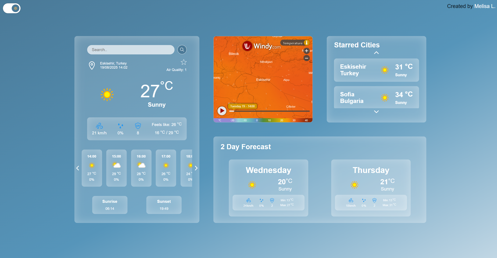
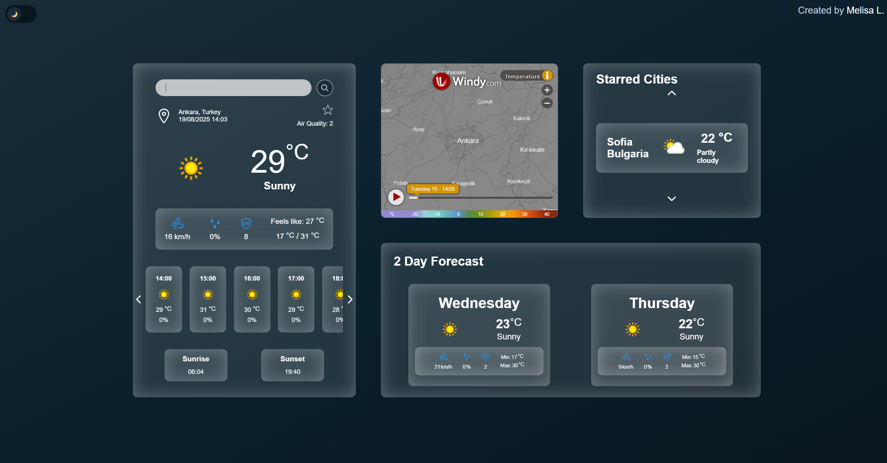

# MelCast

Simple, responsive weather app built with **vanilla JavaScript**, **HTML**, and **CSS**. Fetches live conditions and forecasts from the OpenWeather API and presents them in a clean, mobile-first UI.

---

## Features

> **Live Weather Fetching** – Retrieves current conditions and multi-hour forecast via OpenWeather API using asynchronous requests (AJAX/fetch) and renders them dynamically in the UI.  

> **Starred Locations** – Quickly save favorite cities. Selections persist across sessions using `localStorage` for a fast, personalized experience.  

> **Day/Night Mode** – Remembers your theme preference (and respects the system preference) to keep the interface readable at all times.  

> **Interactive Weather Map** – Temperature map updates when you change city, providing a quick visual overview.  

> **Error Handling & UX Polish** – Loading spinners and graceful fallbacks make network hiccups and empty searches feel smooth instead of jarring.  

> **Modular ES6 Codebase** – Uses ES6 classes/modules and separation of concerns to keep the codebase tidy and maintainable.  

---

### UI Preview

> A few screenshots from the app to give you the vibe:

- **Day Mode** – main dashboard with current conditions and quick actions.  
- **Empty Search State** – clear guidance when no locations are found.  
- **Starred City** – a saved city highlighted for one-tap access.  
- **Temperature Map** – map tiles update as you switch locations.  
- **Hourly Forecast** – timeline of conditions up to early morning.  

(See below for the  screenshots.)

---

## Tech Stack

- **Frontend:** HTML5, CSS3 (responsive with media queries), Vanilla JS (ES6)  
- **APIs:** OpenWeather (forecast & current conditions)  
- **Storage:** `localStorage` for theme + favorites  

---

## Project Notes

- Built from a Figma design and refined during implementation for UX improvements.  
- Layout adapts across phones, tablets, and laptops via responsive CSS.  
- Designed with maintainability in mind (SOLID-ish separation across modules).  

---

### Figma Design

### Screenshots from Melcast
Mode preference is saved into local storage and/or preferred system mode is used.

Day mode.

When no locations are found, it's displayed as shown below.

How it looks after a city is starred.

Changing the city changes the temperature map.

Weather until 5 AM is displayed on the hourly forecast tab.

### Responsive Design 
For large and medium laptops

For medium laptops 

For small laptops

For large and medium tablets

For smaller tablets

One column design for smaller tablets 

For medium phones

For small phones

